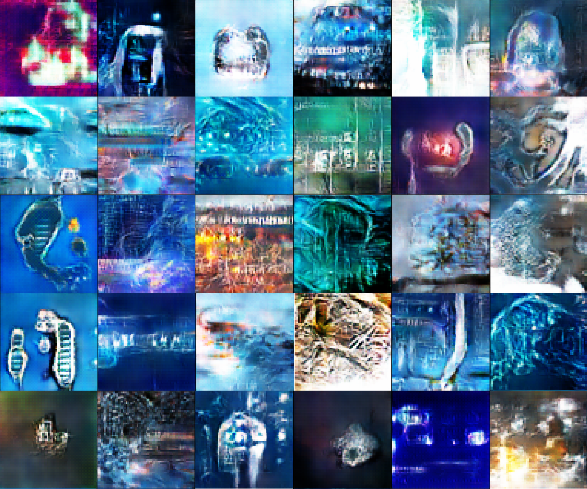

# Generation of AI logos using Wasserstein GAN  
This was my weekend project to learn Wasserstein GAN (WGAN).  
I generated cool logos using AI/ML-related images from Google Images:  

## Keywords
- AI 
- AI ML 
- artificial intelligence 
- artificial general intelligence 
- deep learning 
- machine learning 
- computer vision 
- RPA 
- robotic process automation 
- 人工知能 
- 深層学習  

See code and more images on [my notebook](https://github.com/yuibi/wgan_ai_logo/blob/master/wgan_AI_logo_16x.ipynb).  

## Gallery
